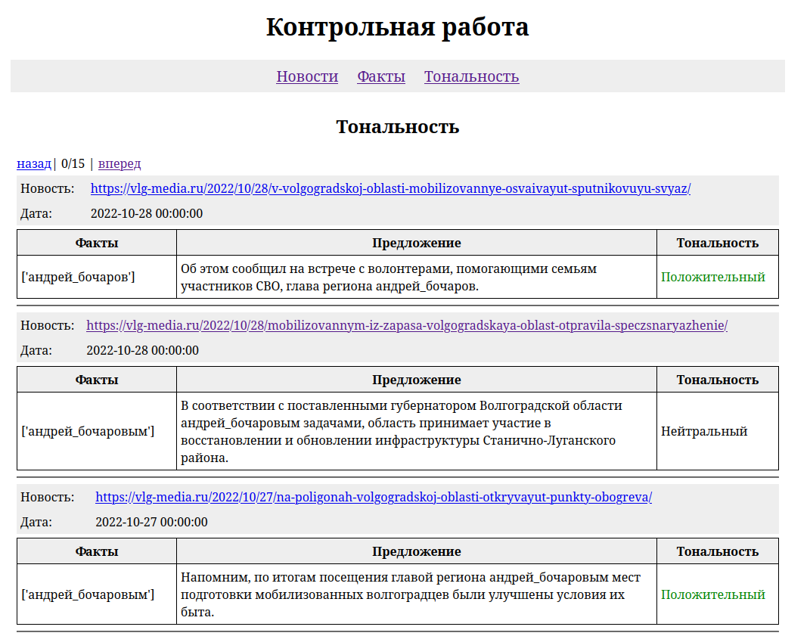

## Установка

Требования:
- docker
- docker-compose
- conda

Конда
```
conda env create -f environment.yml
```

Докер
```
ssh-keygen
cp $HOME/.ssh/id_rsa.pub tomita/
sudo docker-compose build
```

NLTK
```
python -m nltk.downloader punkt wordnet averaged_perceptron_tagger stopwords
```

## Использование

### Включить докер
```
sudo docker-compose up
```

### Парсинг сайта
Парсит сайт и сохраняет новости в БД в коллекцию "news".
```
python src/news_parser.py
```

### Выделение фактов
Выделение предложений и новостей, в которых есть упоминания персон и достопримечательностей Волгоградской области с помощью Томита-парсера
```
python src/tomita.py
```

### Поиск контекстных синонимов
Запуск в консольном интерактивном режиме. При первом запуске будет построена модель word2vec. Также этото скрипт может использоваться как модуль из других скриптов.
```
python src/synonyms.py -i
```

### Анализ тональности
Обучение модели.
```
python src/sentiment.py -t

```

Использование в интерактивном консольном режиме. Также этото скрипт может использоваться как модуль из других скриптов.
```
python src/sentiment.py -p
```

### Веб сервер
```
python src/index.py
```


